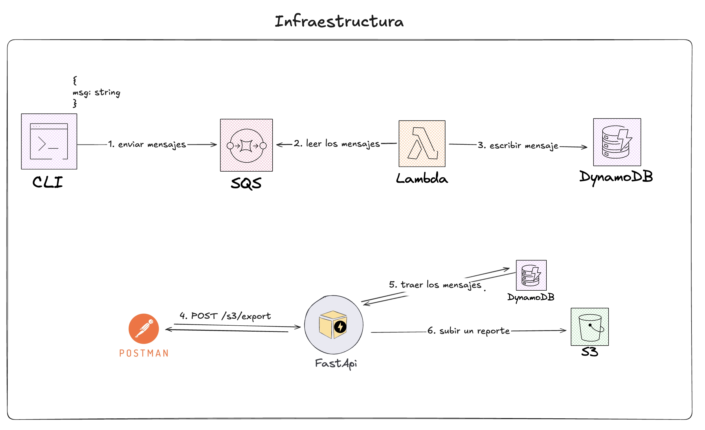
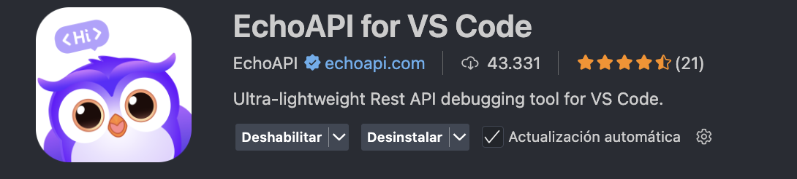

# 🚀 examples-localstack-python




# 🐳 Instalación LocalStack mediante Docker

```bash
docker pull localstack/localstack
docker run -d --name localstackdev -p 4566:4566 -p 4571:4571 -v localstack-data:/var/lib/localstack -v /var/run/docker.sock:/var/run/docker.sock  localstack/localstack
```

# ⚡ Desplegar y conectar Lambda con SQS en LocalStack

##### 🟢 0. Activar el ambiente virtual porque usaremos awslocal

```bash
cd lambda
python3 -m venv .venv
source .venv/bin/activate
pip3 install awscli-local
```

##### 📦 1. Empaquetar la función Lambda

```bash
zip lambda_function.zip handler.py
```

##### 📝 2. Crear la función Lambda en LocalStack

```bash
awslocal lambda create-function \
  --function-name my-lambda \
  --runtime python3.11 \
  --handler handler.lambda_handler \
  --role arn:aws:iam::000000000000:role/lambda-role \
  --zip-file fileb://lambda_function.zip

awslocal lambda list-functions
```

##### 🗄️ 3. Crear la tabla donde almacenaremos los mensajes

```bash
awslocal dynamodb create-table \
    --table-name MyTableDynamo \
    --attribute-definitions AttributeName=id,AttributeType=S \
    --key-schema AttributeName=id,KeyType=HASH \
    --provisioned-throughput ReadCapacityUnits=5,WriteCapacityUnits=5
```

##### 📬 4. Crear una cola para enviar y escuchar mensajes

```bash
awslocal sqs create-queue --queue-name queue-for-example-lambda
awslocal sqs list-queues

```

##### 🔑 5. Dar permiso a la Lambda para SQS y DynamoDB

```bash

awslocal lambda add-permission \
  --function-name my-lambda  \
  --statement-id sqs-access \
  --action "lambda:*" \
  --principal "*" \
  --source-arn arn:aws:sqs:us-east-1:000000000000:queue-for-example-lambda


awslocal lambda add-permission \
  --function-name my-lambda \
  --statement-id dynamodb-access \
  --action "dynamodb:*" \
  --principal "*" \
  --source-arn arn:aws:dynamodb:us-east-1:000000000000:table/MyTableDynamo
```

##### 🔗 6. Conectar la SQS con la Lambda para que cada mensaje que llegue se procese por la Lambda

```bash
awslocal lambda create-event-source-mapping \
  --function-name my-lambda \
  --event-source-arn arn:aws:sqs:us-east-1:000000000000:queue-for-example-lambda
```

##### ✉️ 7. Enviar un mensaje de prueba a la SQS

```bash
awslocal sqs send-message \
  --queue-url http://localhost:4566/000000000000/queue-for-example-lambda \
  --message-body "{ 'msg': 'mensaje 1'}"

awslocal sqs send-message \
  --queue-url http://localhost:4566/000000000000/queue-for-example-lambda \
  --message-body "{ 'msg': 'mensaje 2'}"

awslocal sqs send-message \
  --queue-url http://localhost:4566/000000000000/queue-for-example-lambda \
  --message-body "{ 'message': 'mensaje 3'}"

awslocal sqs send-message \
  --queue-url http://localhost:4566/000000000000/queue-for-example-lambda \
  --message-body "{ 'message': 'mensaje 4'}"
```

# 🌐 Levantar API

##### 🗂️ Crear el S3 de reporte

```bash
awslocal s3 mb s3://my-bucket
```

⚠️ **ABRIR OTRA TERMINAL**

🐍 Crea un entorno virtual de Python, que es un espacio aislado para trabajar en proyectos.

```bash
cd fast-api
python3 -m venv .venv
source .venv/bin/activate
```

📦 Instalación de librerías:

```bash
pip3 install -r requirements.txt
```

🚦 Comandos para levantar el API:

```bash
uvicorn main:app --host 0.0.0.0 --port 8000 --reload
```


🔔 **Llamar al endpoint POST /s3/export para generar un documento en el S3**

🧩 Puedes usar la extensión de EchoApi:
